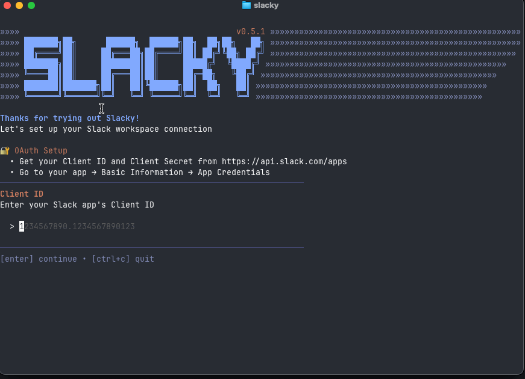

```
███████╗██╗      ██████╗  ██████╗██╗  ██╗██╗   ██╗
██╔════╝██║     ██╔═══██╗██╔════╝██║ ██╔╝╚██╗ ██╔╝
███████╗██║     ████████║██║     █████╔╝  ╚████╔╝
╚════██║██║     ██╔═══██║██║     ██╔═██╗   ╚██╔╝
███████║███████╗██║   ██║╚██████╗██║  ██╗   ██║
╚══════╝╚══════╝╚═╝   ╚═╝ ╚═════╝╚═╝  ╚═╝   ╚═╝
```

<p>
    <a href="https://github.com/jcserv/slacky/releases">
        
    </a>
    <a href="https://pkg.go.dev/github.com/jcserv/slacky?tab=doc">
        
    </a>
    <a href="https://github.com/charmbracelet/crush/actions"></a>
    <a href="https://codecov.io/gh/jcserv/slacky" > 
         
    </a>
</p>

a simple, no-frills Slack client in the terminal



## features 🚀

- sending messages + reactions
- threads
- activity
- media partially supported through links
- keybind remapping
- i18n
- oauth

## installation 📦

1. Create a new Slack app at https://api.slack.com/apps
2. Import the manifest.json
3. Get the Client ID + Client Secret
4. Run `slacky`

### homebrew

`brew tap jcserv/cask`

`brew install jcserv/cask/slacky`

## limitations ⚠️
- since this is a client application, we rely on user tokens. socket mode is not implemented for these afaik, so we have to poll for updates 😭
- lots of missing features! See [TODO.md](./TODO.md)

## references 📚
- crush
- nvim
- zuse
- gh-dash
- slack-term